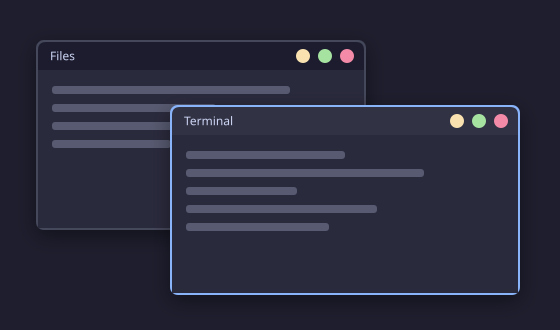
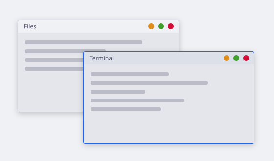
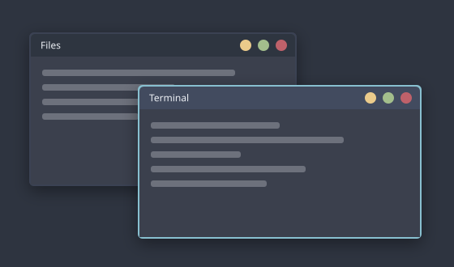
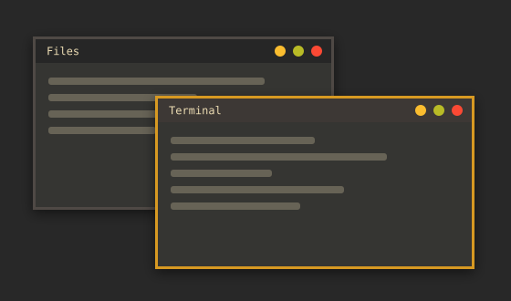
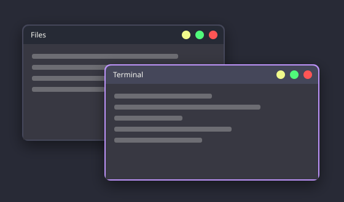
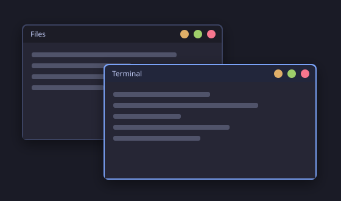
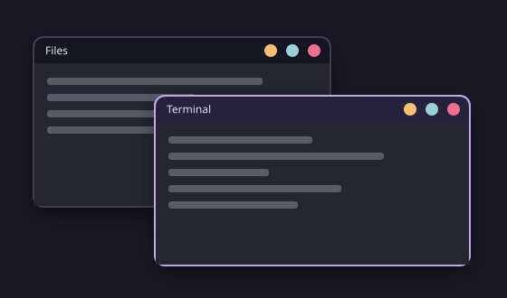
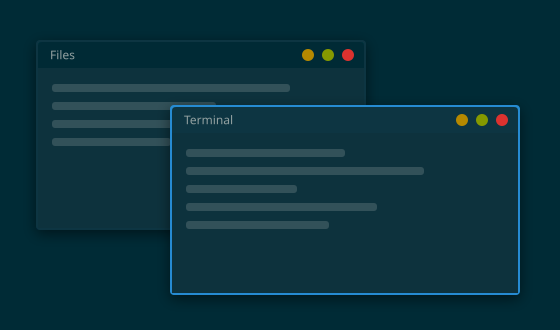
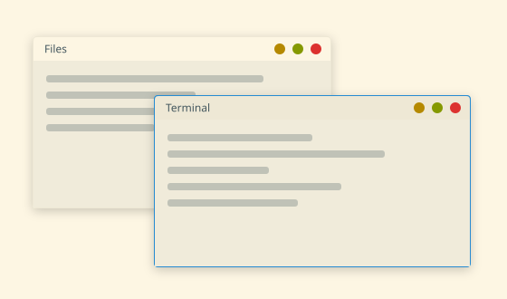
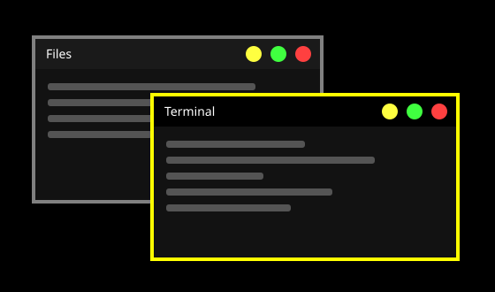

<p align="center">
  
</p>

<p align="center"><b>A simple floating Wayland compositor</b> – themes, animations, workspaces and one config file, on wlroots.</p>

<p align="center">
  <a href="https://github.com/L0rdr-ln/Simple-Floating-Wayland-Compositor/actions/workflows/build.yml"></a>
  <a href="LICENSE"></a>
  
  
</p>

<p align="center">
  <a href="#build-and-run">Getting started</a> |
  <a href="docs/CONFIGURATION.md">Configuration</a> |
  <a href="#themes">Themes</a> |
  <a href="docs/THEMES.md#one-theme-for-the-whole-desktop-templating">One theme for the desktop</a> |
  <a href="docs/ROADMAP.md">Roadmap</a>
</p>

---

A small, easy-to-configure **floating (stacking) Wayland compositor** on top of
[wlroots](https://gitlab.freedesktop.org/wlroots/wlroots): overlapping windows with title bars,
themes, animations and workspaces, configured with **one plain-text file** that reloads when you
save it.

> **Status: alpha.** Everything below is implemented and covered by automated end-to-end tests
> that start the compositor on a headless backend in CI. It has **not been tried on real
> hardware yet** (TTY/DRM, several GPUs, multi-monitor): expect rough edges there and please
> [report them](https://github.com/L0rdr-ln/Simple-Floating-Wayland-Compositor/issues/new/choose).
> Xwayland is not supported (X11-only programs will not start). See the [roadmap](docs/ROADMAP.md).

## Highlights

- **Floating windows** – move and resize with Alt+drag or the title bar, maximize, fullscreen,
  minimize, snap to screen edges and to other windows, cascade placement, several outputs.
- **Server-side decorations** – title bar, borders, rounded corners, soft shadows, drawn from the
  theme (cairo + pango).
- **Themes** – small text files; ten included (below). Optional separate package, the compositor
  has a built-in default look.
- **One theme for the whole desktop** – the same file also colors your bar, launcher,
  terminal, notifications and lock screen through
  [templates](docs/THEMES.md#one-theme-for-the-whole-desktop-templating).
- **Animations, Hyprland style** – popin, slide and slidefade on open and close, workspace slides,
  a border color fade, your own Bézier curves, `animation = ...` lines that mostly work as in a
  Hyprland config, or a ready-made `preset = hyprland`; Wayfire style **fire** (windows burn
  away with flames), **squeeze** (TV off) and **zoom**; one switch
  turns them all off.
- **Workspaces** (1–9), **layer-shell** bars/wallpapers/launchers (waybar, swaybg, fuzzel, ...),
  **screen lock** (swaylock), idle (swayidle), taskbars, clipboard managers, screenshots (grim).
- **Simple configuration** – one INI-style file, sensible defaults, mistakes are reported with
  their line number and never stop the compositor. No scripting language.
- **Plugins** – effects and extras live in plugins (`[plugins] load = wobbly`) from the
  [sfwc-plugins](https://github.com/L0rdr-ln/sfwc-plugins) repository, so the core stays small
  ([plugin API](docs/PLUGINS.md)).
- **Small and readable** – C11 against wlroots, split by topic ([architecture](docs/ARCHITECTURE.md)).

## Themes

<table>
<tr><td align="center"><br><sub><b>Default</b> · <code>theme = default</code></sub></td><td align="center"><br><sub><b>Light</b> · <code>theme = light</code></sub></td><td align="center"><br><sub><b>Nord</b> · <code>theme = nord</code></sub></td></tr>
<tr><td align="center"><br><sub><b>Gruvbox Dark</b> · <code>theme = gruvbox-dark</code></sub></td><td align="center"><br><sub><b>Dracula</b> · <code>theme = dracula</code></sub></td><td align="center"><br><sub><b>Tokyo Night</b> · <code>theme = tokyo-night</code></sub></td></tr>
<tr><td align="center"><br><sub><b>Rosé Pine</b> · <code>theme = rose-pine</code></sub></td><td align="center"><br><sub><b>Solarized Dark</b> · <code>theme = solarized-dark</code></sub></td><td align="center"><br><sub><b>Solarized Light</b> · <code>theme = solarized-light</code></sub></td></tr>
<tr><td align="center"><br><sub><b>High Contrast</b> · <code>theme = high-contrast</code></sub></td></tr>
</table>

<sub>These pictures are mock-ups drawn from each theme file by
[`tools/theme-preview.py`](tools/theme-preview.py) (colors, borders, corner radius, buttons,
shadow), not screenshots. Switch with `theme = nord` in the config. Write your own: see
[docs/THEMES.md](docs/THEMES.md). A theme that ships its own templates can make other
programs run commands, so read those before using a theme from someone you do not know
([details](docs/THEMES.md#safety-what-installing-a-theme-trusts)).</sub>

## Build and run

Dependencies (Debian/Ubuntu names; check your distribution):

| | Packages |
|---|---|
| tools | `meson ninja-build pkg-config gcc git` (meson ≥ 1.4 when wlroots is built from the wrap) |
| libraries | `libwayland-dev wayland-protocols libxkbcommon-dev libcairo2-dev libpango1.0-dev libfontconfig-dev libpixman-1-dev libdrm-dev` |
| wlroots 0.20 | `libwlroots-0.20-dev` if your distribution has it, otherwise meson builds it from `subprojects/wlroots.wrap`, together with the newer wayland (≥ 1.24) and xkbcommon (≥ 1.8) it needs, and libdrm/pixman if yours are too old (needs network, `bison flex`, and `libinput-dev libudev-dev libseat-dev libegl-dev libgles-dev libgbm-dev libvulkan-dev glslang-tools hwdata libdisplay-info-dev libliftoff-dev` plus the xcb development packages, see [the CI setup](.github/workflows/build.yml)) |

```sh
meson setup build
meson compile -C build
meson test -C build --print-errorlogs
./build/sfwc            # inside another Wayland session it opens as a window
```

Install and use it from a display manager or a TTY:

```sh
sudo meson install -C build     # sfwc, sfwc-theme-apply, man pages, wayland-sessions/sfwc.desktop
sfwc                            # on a TTY; or pick "SFWC" in your display manager
```

Optional extra themes and templates (`themes/` is a separate package):

```sh
meson setup build-themes themes && sudo meson install -C build-themes
```

**Try it on your machine** (nested in your desktop, or on a console) and get a report to paste
into an issue with one command: `tools/try-sfwc.sh`, see
[docs/HARDWARE-TESTING.md](docs/HARDWARE-TESTING.md).

Parser and unit tests only, without wlroots: `meson setup build -Dcompositor=false`.

## Default keys

The modifier is Alt so that it works when running nested; set `mod = Super` for a TTY. Everything
can be rebound, see [docs/CONFIGURATION.md](docs/CONFIGURATION.md).

| Keys | Action |
|---|---|
| Alt+Return | open the terminal (`terminal` in the config, default `foot`) |
| Alt+q | close the window |
| Alt+Tab | cycle windows |
| Alt+f / Alt+F11 | maximize / fullscreen |
| Alt+m / Alt+Shift+m | minimize / restore |
| Alt+1…4 / Alt+Shift+1…4 | switch workspace / send the window to a workspace |
| Alt+o / Alt+Shift+o | window / focus to the next output |
| Alt+drag (left / right) | move / resize |
| Alt+Shift+r | reload the config |
| Alt+Esc | quit |
| Ctrl+Alt+F1…F12 | switch virtual terminal (on a TTY) |

## Configuration in a minute

```sh
mkdir -p ~/.config/sfwc && cp config/sfwc.conf ~/.config/sfwc/sfwc.conf
```

```ini
[general]
theme = nord
mod = Super
workspaces = 5

[windows]
gap = 10

[output:HDMI-A-1]
scale = 1.5
position = 1920,0

[keybinds]
$mod+Return = spawn:foot
$mod+d = spawn:fuzzel
$mod+q = close

[autostart]
exec = waybar
exec = swaybg -c @colors.background:hex@
```

Saving the file applies it at once. Every option is explained in
[docs/CONFIGURATION.md](docs/CONFIGURATION.md) and in the commented example
[config/sfwc.conf](config/sfwc.conf); `man sfwc.conf` has the short version.

## How it is tested

Each push builds wlroots and sfwc with AddressSanitizer and UndefinedBehaviorSanitizer and runs:

- **unit tests** for the config, theme and template parsers (error messages with line numbers,
  limits, every shipped theme for validity and readable contrast), a garbage-input fuzz test, and the theme helper;
- **end-to-end tests** that start the compositor headless and talk to it with a real Wayland
  client using virtual keyboard/pointer input and screen captures: windows and popups,
  multi-output, decorations checked pixel by pixel, animations, layer-shell, workspaces and the
  screen lock;
- a smoke test, and a staged `meson install` that checks the installed files.

Details and how to add a test: [CONTRIBUTING.md](CONTRIBUTING.md).

## Documentation

[Configuration](docs/CONFIGURATION.md) ·
[Themes and templating](docs/THEMES.md) ·
[Architecture](docs/ARCHITECTURE.md) ·
[Roadmap](docs/ROADMAP.md) ·
[Changelog](CHANGELOG.md) ·
[Contributing](CONTRIBUTING.md) ·
[Security policy](SECURITY.md)

## License

MIT – see [LICENSE](LICENSE).
